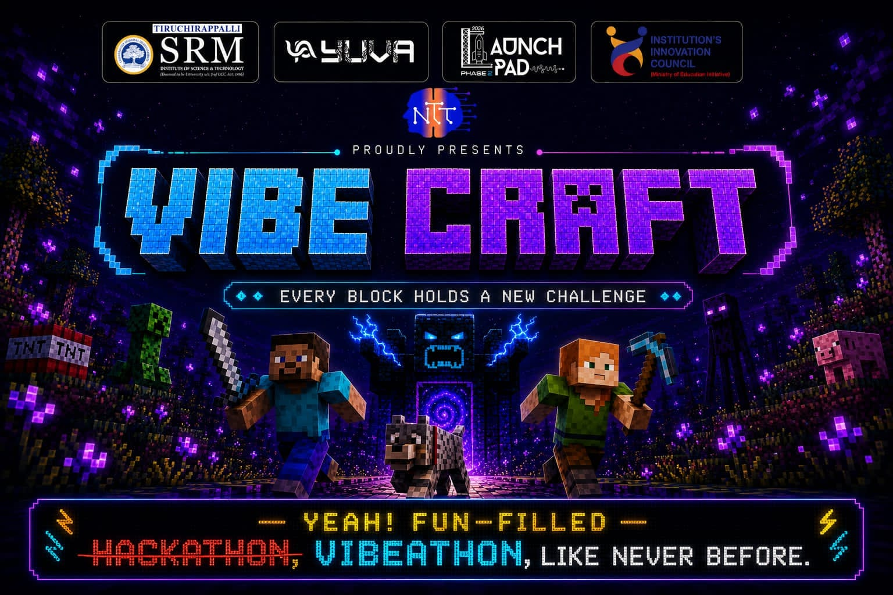

# VibeCraft 2026 — Event Website

The official website for **VibeCraft Season 1**, a one-day, in-person vibe-coding hackathon run by **Neuro Tech Titans (NTT)** at SRMIST Tiruchirappalli as part of **YUVA'26**.

Minecraft-inspired, built with React + Three.js, with an organiser-controlled live event timer and a server-gated Round 2 problem statement.



---

## The event at a glance

| | |
|---|---|
| **Date** | 28 September 2026 |
| **Venue** | SRMIST Tiruchirappalli — fully offline, in person |
| **Teams** | 2–4 members, bring your own device |
| **Entry** | ₹500 per team |
| **Prize pool** | ₹10,000 + credits, goodies, and partner-backed certificates |
| **Register** | [CampusQuest](https://campusquest.incuman.com/events/detail/ddc130a5-ef6e-4b00-9e32-41fb7d7ee4af) (registration is CampusQuest only; Unstop is for event info) |

**Format.** Three rounds. Round 1 is an elimination round open to every registered team. Round 2 and the Finale are revealed only to teams that clear Round 1. AI tools are fully allowed — it's a vibe-coding event. Both technical and non-technical tasks count toward evaluation.

**Judging.** Relevance to the problem statement, feasibility, use of the provided dataset, UX and solution design, and performance in the Technical Tasks round. Strong performance in non-technical tasks gives a bonus going into the next round.

---

## Features

- **Block-dissolve banner intro** — the event poster breaks apart block by block as you scroll and reassembles on the way back up. Driven by scroll position, rendered on a canvas, skipped for users with `prefers-reduced-motion`.
- **3D voxel hero** — a lazy-loaded React Three Fiber diorama with a holographic countdown timer.
- **Live event timer** — organisers start, pause, resume, stop, and adjust the clock from `/admin`; every open page updates within about a second via Supabase Realtime.
- **Server-gated Round 2** — teams enter an access code to reveal the Round 2 problem statement. The statement never ships in the frontend bundle (see [How the Round 2 gate works](#how-the-round-2-gate-works)).
- **Graceful fallback** — with no Supabase configured, the site still runs: the timer shows a static preview and the admin panel and Round 2 gate show a "not configured" state.

---

## Tech stack

| Layer | Tools |
|---|---|
| Frontend | React 18, TypeScript, Vite 5 |
| Styling & motion | Tailwind CSS, Framer Motion |
| 3D | Three.js, @react-three/fiber, @react-three/drei |
| Routing | React Router (`/` and `/admin`) |
| Backend | Supabase (Postgres, Row-Level Security, Realtime, Auth) |
| Hosting | Vercel (SPA rewrite in `vercel.json`) |

---

## Project structure

```
.
├── public/
│   └── banner.jpg              # Event poster used by the intro
├── src/
│   ├── admin/
│   │   └── AdminPanel.tsx      # /admin — organiser login + timer controls
│   ├── components/
│   │   ├── BannerIntro.tsx     # Scroll-driven block-dissolve poster
│   │   ├── Hero.tsx            # Hero section, lazy-loads the 3D scene
│   │   ├── VoxelDiorama.tsx    # Three.js voxel scene
│   │   ├── voxel/parts.tsx     # Voxel models (blocks, characters, torches)
│   │   ├── HologramTimer.tsx   # Timer display
│   │   ├── Round2Gate.tsx      # Access-code gate for Round 2
│   │   └── ...                 # About, Rules, Format, Rounds, Prizes, Partners, Submit, Nav, Footer
│   ├── hooks/useTimer.ts       # Loads + subscribes to the live timer, handles fallback
│   ├── lib/
│   │   ├── supabase.ts         # Supabase client (null when not configured)
│   │   └── timer.ts            # Pure timer state → display logic
│   ├── config.ts               # Event times, default duration, external links
│   ├── App.tsx
│   └── main.tsx
├── supabase/
│   ├── schema.sql              # Tables, RLS policies, verify_round2 function
│   └── SETUP.md                # Step-by-step backend setup
├── legacy/index.html           # Original single-file static version (v1)
├── .env.example
└── vercel.json
```

---

## Getting started

**Requirements:** Node.js 18 or newer.

```bash
git clone https://github.com/IamRSHC/Vibecraft.git
cd Vibecraft
npm install
npm run dev
```

The site runs at `http://localhost:5173`. Without environment variables it runs in fallback mode, which is fine for working on the UI.

### Scripts

| Command | What it does |
|---|---|
| `npm run dev` | Start the Vite dev server |
| `npm run build` | Production build into `dist/` |
| `npm run preview` | Serve the production build locally |
| `npm run typecheck` | Type-check with `tsc --noEmit` |

### Environment variables

Copy `.env.example` to `.env.local`:

```
VITE_SUPABASE_URL=https://YOUR-PROJECT.supabase.co
VITE_SUPABASE_ANON_KEY=YOUR-ANON-KEY
```

The anon key is public by design. It only grants what the Row-Level Security policies allow: anyone can read the timer, only the organiser account can write it, and nobody can read the Round 2 table directly.

---

## Backend setup (live timer + Round 2)

Full walkthrough in [`supabase/SETUP.md`](supabase/SETUP.md). In short:

1. Create a Supabase project and note its URL and anon key.
2. Add a single organiser user under *Authentication → Users*, then disable new sign-ups.
3. In `supabase/schema.sql`, replace `ADMIN_EMAIL_HERE` with that organiser's email and run the file in the SQL editor.
4. Set the real Round 2 access code and problem statement with an `update public.round2 ...` query.
5. Add the two environment variables locally and on Vercel, then redeploy.

### How the timer works

A single `timer_state` row holds the status (`idle`, `running`, `paused`, `ended`), the end timestamp while running, and the frozen remaining time while paused. Clients compute the remaining time locally from that row, so the display stays smooth without polling, and any change the organiser makes is pushed to every client through Supabase Realtime.

### How the Round 2 gate works

The `round2` table has RLS enabled and **no SELECT policy**, so the public key cannot read it. The only way in is the `verify_round2(code)` Postgres function, which runs as `SECURITY DEFINER`, compares the submitted code server-side (case- and whitespace-insensitive), and returns the title and body only on a match. The problem statement is never in the JavaScript bundle and never stored in the browser; only the entered code is remembered locally so the page can re-verify on reload.

---

## Configuration

Event-specific values live in [`src/config.ts`](src/config.ts):

| Constant | Purpose |
|---|---|
| `EVENT_START`, `EVENT_END` | Event window (IST), used by the fallback timer |
| `DEFAULT_DURATION_MS` | Duration pre-filled in the admin panel (9 hours) |
| `REGISTER_URL` | CampusQuest registration link |
| `SUBMIT_FORM_URL` | Project submission form |

Page copy (rules, judging criteria, partners) lives directly in the matching component under `src/components/`.

---

## Deployment

The repo is set up for Vercel. Import it, keep the default Vite settings (build `npm run build`, output `dist`), add the two `VITE_SUPABASE_*` variables under *Project → Settings → Environment Variables*, and deploy. `vercel.json` rewrites all routes to `index.html` so `/admin` works on direct load.

---

## Using the admin panel

Go to `/admin` and sign in with the organiser account. From there you can set a duration and **Start**, **Pause**, **Resume**, **Stop**, **Reset**, or nudge the clock by ±1 minute. Participants can only read the timer; the database rejects writes from any other account.

---

## Organised by

**Neuro Tech Titans (NTT)** · SRMIST Tiruchirappalli · YUVA'26

Presented alongside SRM Institute of Science & Technology, Tiruchirappalli, Launchpad 2026, and the Institution's Innovation Council.
